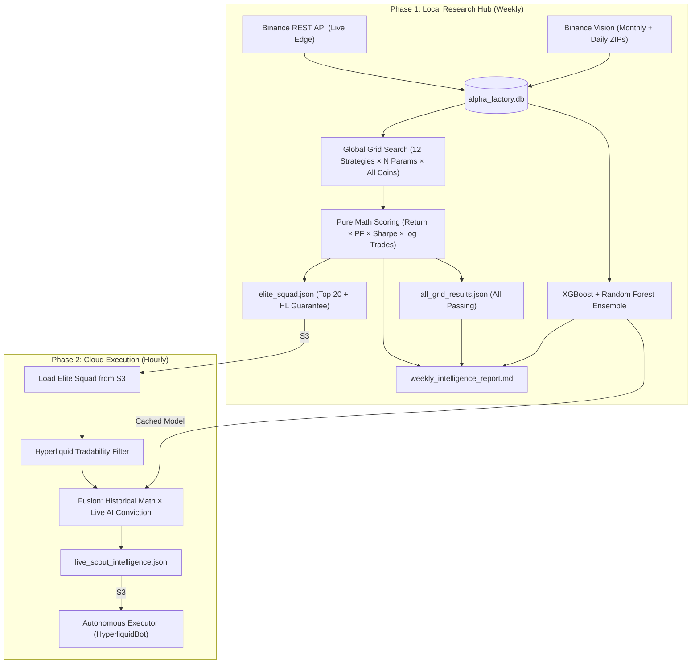
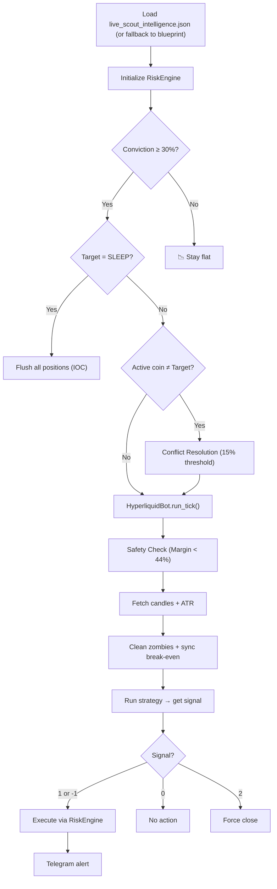

# Alpha Factory — System Architecture

> A quantitative crypto research and trading system. Pure Binance data powers a global strategy grid search, an AI ensemble scout, and an autonomous executor on Hyperliquid.

---

## The Big Picture

Alpha Factory is a **two-phase** system:

1. **Local Research Hub** (Weekly) — Ingests years of Binance historical data, trains an XGBoost + Random Forest ensemble, performs an exhaustive grid search across 200+ symbols and 12 strategy families, and produces a **Top 20 Elite Squad** blueprint (with HL tradability guarantee), a full **all_grid_results.json** of every passing strategy, and a **Global Intelligence Report** with market-wide distribution analysis.

2. **Cloud Execution Layer** (Hourly) — An **AI Scout** re-scores the Elite Squad members using live market data, filters for Hyperliquid tradability, and feeds the fused ranking into an autonomous trading bot.

### Data Purity Policy
All historical and live-edge data is sourced **exclusively from Binance** (API + Vision archives). Hyperliquid is used only for execution and tradability filtering — never as a data source for the research database.



---

## Quick Start

```bash
# 1. Environment
python -m venv .venv && .venv\Scripts\activate
pip install -r requirements.txt

# 2. Ingest historical data (Binance Vision + API gap-fill)
python master.py ingest --top 50 --timeframe 1h,15m

# 3. Check what you have
python master.py status

# 4. Run the full weekly cycle (Train AI → Grid Search → Report)
python master.py full --market futures

# 5. Verify database health
python master.py audit --market futures

# 6. Run hourly scout (designed for Lambda/cron)
python master.py scout
```

---

## Directory Structure

```
asset-analysis/
├── master.py                        # CLI entry point — runs everything
├── main.py                          # Legacy CLI (sync/lab/analyze modes)
├── alpha_factory.db                 # Central SQLite database
├── .env                             # API keys, Telegram creds, DB path override
│
├── data_pipeline/                   # Data Foundation
│   ├── database.py                  #   Schema: ohlcv, sync_state, blueprints tables
│   ├── sync_manager.py              #   Binance Vision → CCXT gap-fill orchestration
│   ├── binance_vision.py            #   Monthly ZIP + Daily Bridge downloads
│   ├── data_fetcher.py              #   CCXT exchange wrapper, top-N volume discovery
│   ├── hyperliquid_sync.py          #   HL universe listing + @index spot mapping
│   ├── data_auditor.py              #   Non-destructive gap/spike/health grading (A+ → F)
│   ├── source_scrubber.py           #   Purge & restore recent candles from pure Binance
│   ├── bulk_ingest.py               #   Batch historical processing
│   ├── s3_storage.py                #   S3 upload/download utilities
│   └── push_db_to_s3.py             #   Push local DB to S3 for Lambda
│
├── analytics/                       # AI & Intelligence
│   ├── analytics.py                 #   XGBoost + RF training, probabilities, seasonality, correlations
│   ├── weekly_orchestrator.py       #   Train once → Pipeline A (Grid Search) → Pipeline B (Report)
│   ├── generate_report.py           #   Markdown intelligence report generator
│   ├── llm_analyzer.py              #   OpenRouter LLM (Qwen) anti-sycophant verdicts
│   └── models/                      #   Cached model files (xgboost_futures.json, .pkl)
│
├── backtester/                      # Strategy Discovery
│   ├── build_bot_blueprint.py       #   Pipeline A: Full-market grid search → Elite Squad
│   ├── engine.py                    #   HyperBacktester with ATR SL/TP simulation
│   ├── vector_engine.py             #   Lightweight vectorized RSI/EMA backtester
│   └── laboratory.py                #   Legacy parameter sweep + Gemini AI refinement
│
├── bot/                             # Live Trading (AWS Lambda)
│   ├── config.py                    #   Environment: bucket, keys, margin limits, testnet toggle
│   ├── bot_executor.py              #   HyperliquidBot class + executor_handler Lambda entry
│   ├── strategies.py                #   12 VectorStrategy classes + STRATEGY_CONFIG registry
│   ├── risk_engine.py               #   RiskEngine: OI/funding/POC checks, SL/TP, zombies
│   ├── data_feed.py                 #   MarketData (API + local DB), AssetManager, daily receipt
│   ├── indicators.py                #   ADX (Wilder), Point of Control, CVD slope
│   └── utils.py                     #   S3Interface, StateManager, Telegram Guard
│
└── reports/                         # Archived timestamped intelligence reports
```

---

## Data Foundation

### Ingestion Sources

| Source | File | Purpose |
|:--|:--|:--|
| **Binance Vision** | `binance_vision.py` | Free public CSV archives. Monthly ZIPs + **Daily Bridge** for current month (zero-gap). |
| **Binance REST API** | `data_fetcher.py` | CCXT-based gap-filling. Also discovers top-N symbols by 24h volume. |
| **Live Edge Sync** | `master.py cmd_sync_live` | Fetches latest 100 candles from Binance API for all DB symbols. |

### Hyperliquid Integration (Execution Only)

`hyperliquid_sync.py` provides two critical services for the **execution layer**, not for data ingestion:
- **Universe Listing**: `get_hyperliquid_universe()` — returns all tradable perp names.
- **Symmetry Mapping**: `get_hl_symbol_map()` — maps canonical names (BTC/USDT) to HL API strings (@index for spot, direct name for perps). Handles U-token remapping (UBTC → BTC).

### Database Schema (`database.py`)

| Table | Purpose | Primary Key |
|:--|:--|:--|
| `ohlcv` | All candle data | `(symbol, timeframe, market, timestamp)` |
| `sync_state` | Resume-point tracker per partition | `(symbol, timeframe, market)` |
| `blueprints` | Archived winning strategy configs | `id` |

Uses **WAL** journal mode with tuned cache for concurrent read performance.

### Data Integrity Suite

`data_auditor.py` provides **non-destructive** health checks:
- **Gap Detection**: Identifies missing candles via timestamp diff analysis.
- **Spike Detection**: Flags candles with >20% open→close moves.
- **Health Grading**: A+ (≥95%) through F (<50%), factoring gap density.

`source_scrubber.py` provides **destructive** restoration:
- Deletes the most recent N candles per partition (potential contamination zone).
- Triggers `SyncManager` to backfill from pure Binance sources.

---

## The AI Ensemble (`analytics.py`)

### Architecture
Two models trained on the same chronological split (70/15/15):

| Model | Library | Purpose |
|:--|:--|:--|
| **XGBoost** | `xgboost` | Primary classifier. Multi-class softprob. |
| **Random Forest** | `sklearn` | Validation ensemble member. |

### Multi-class Targets
Based on 5-candle forward returns:
- **0 (Flat)**: Move < 0.5% in either direction.
- **1 (Bullish)**: Move > +0.5%.
- **2 (Bearish)**: Move < -0.5%.

### Feature Set (15 features)
```
rsi, macd, macd_signal, macd_diff, ema_20, ema_50, ema_200,
volatility_20, z_score_20, volume,
timeframe_minutes, hour_sin, hour_cos, day_sin, day_cos
```

### Model Persistence
- XGBoost: `analytics/models/xgboost_{market}.json` (native save)
- Random Forest: `analytics/models/xgboost_{market}.pkl` (pickle)
- Metadata: `analytics/models/xgboost_{market}_meta.json` (accuracy)

Models auto-cache and reload on subsequent runs unless `--force-train` is passed.

---

## Pipeline A — The Strategist (`build_bot_blueprint.py`)

**Goal**: Find the best strategy × asset × timeframe combinations across the entire market.

### Grid Search Parameters
- **Symbols**: All distinct symbols in the database (typically 100-200+).
- **Timeframes**: 15m, 1h, 4h.
- **Strategies**: 12 families with combinatorial parameter sweeps (see Strategy Catalog below).
- **Data source**: Local SQLite via `use_db=True` for ~50x speed over API.

### Scoring: Pure Math
The grid search does **not** use AI probabilities. Scoring is purely historical:
```
Score = (Return × Profit_Factor × Sharpe) × log₁₀(Trades)
```

### Filters (Disqualification)
| Filter | Threshold | Purpose |
|:--|:--|:--|
| Min Trades | Dynamic (TPD × total_days) | Reject curve-fitted flukes |
| Profit Factor | > 1.2 | Reject unprofitable edges |
| Recent Return | > 0 (last 24h) | Reject stale or decaying signals |

### Outputs
1. **`all_grid_results.json`** → S3 + Local — ALL strategies that passed filters. Used by Pipeline B for distribution analysis.
2. **`elite_squad.json`** → S3 + Local — Top 20 results by Pure Math score, with an **HL tradability guarantee** (if no HL-tradable token makes the top 20 organically, the top 3 HL-tradable candidates are injected).
3. **`champion_blueprint.json`** → S3 — #1 result as legacy bot config.

If zero strategies pass the gauntlet, the bot enters **SLEEP** mode.

---

## Pipeline B — Intelligence Report (`generate_report.py`)

**Goal**: Generate a human-readable Markdown report for strategic review.

### Report Sections
1. **Elite Squad Table**: Top 20 by Pure Math score with α, Sharpe, PF columns.
2. **Strategy Distribution**: Computed from ALL passing strategies (50-200+), not just the squad.
3. **Timeframe Distribution**: Computed from ALL passing strategies.
4. **Top Tokens by Strategy Count**: Which tokens have the most profitable configurations.
5. **AI Movement Conviction**: Top 15 symbols ranked by P(Bull) + P(Bear).

### Additional Intelligence (`analytics.py`)
- **Seasonality**: Day-of-week and hour-of-day return profiles.
- **Correlation Matrix**: Top 5 most/least correlated pairs for systemic risk.
- **LLM Verdict** (`llm_analyzer.py`): OpenRouter/Qwen cynical risk assessment (optional).

---

## The Scout (`master.py cmd_scout`)

**Goal**: Hourly re-inference loop that fuses historical research with live AI.

### Process
1. Load `elite_squad.json` from S3 (Top 20 + HL injections).
2. Filter for Hyperliquid tradability via `get_hyperliquid_universe()`.
3. Load cached XGBoost + RF ensemble from `analytics/models/`.
4. Run `get_latest_probabilities()` for squad members only.
5. Compute **Movement Conviction** = P(Bull) + P(Bear).
6. **Fused Score** = `Historical_Math_Score × Live_Conviction`.
7. Upload `live_scout_intelligence.json` to S3.

---

## The Bot — Autonomous Executor (`bot_executor.py`)

Runs on **AWS Lambda**. Two task handlers:

### Task: `execute_trades`



### Task: `send_daily_report`
Fetches fills, funding, and fees from Hyperliquid and sends a Telegram PnL receipt.

### Risk Engine Checks
Before any trade executes:
- **Margin Safety**: Account margin utilization < 44%.
- **Liquidity Floor**: Open Interest > $10M.
- **Funding Trap**: Funding rate < ±2%.
- **POC Gravity**: Price must be on the favorable side of the Point of Control.

### Telegram Security
`utils.py` validates `TELEGRAM_CHAT_ID` before every message. Unauthorized group messages are silently dropped.

---

## Strategy Catalog (12 Families)

All strategies implement `VectorStrategy.get_signal_column(df) → Series[0, 1, -1, 2]`.

### Trend Following
| Strategy | Key Idea | Exits |
|:--|:--|:--|
| `SimpleBreakout` | Donchian-style N-period breakout | Flips + ATR |
| `EMACrossover` | Fast/Slow EMA cross events | Flips + ATR |
| `MACDStrategy` | MACD cross with ADX trending filter | Smart 2 + ATR |
| `BBSqueezeBreakout` | Bollinger squeeze → band break | Flips + ATR |

### Mean Reversion
| Strategy | Key Idea | Exits |
|:--|:--|:--|
| `RSIStrategy_Turbo` | Fast RSI hooks + BB crash override | Smart 2 (re-entry zone) |
| `BollingerReversion` | Band touch + green/red bounce confirm | Smart 2 (failed bounce) |
| `OrderFlow` | VWAP Value Area + CVD absorption | Smart 2 (CVD flip) |

### Order Flow
| Strategy | Key Idea | Exits |
|:--|:--|:--|
| `OrderFlowSweep` | Sweep PA level + CVD confirmation | Flips + ATR |
| `OrderFlowReclaim` | Wick below bodies + volume + CVD | Flips + ATR |

### Hybrid / Confluence
| Strategy | Key Idea | Exits |
|:--|:--|:--|
| `HybridWilder` | RSI (Wilder) × Bollinger double confirm | Smart 2 |
| `HybridCutler` | RSI (Cutler/SMA) × Bollinger double confirm | Smart 2 |
| `PriceAction` | PA breakout + deviation + volume filter | Flips + ATR |

### Optional Filters (per-strategy)
- **VWAP Filter**: Confirms trade is on the right side of daily volume.
- **HTF Trend Filter**: Requires 1h/4h EMA trend alignment.

---

## Signal Taxonomy

| Signal | Meaning | Bot Action |
|:--|:--|:--|
| `0` | Neutral | Hold current state. |
| `1` | Buy / Long | Open Long (if Risk Engine approves). |
| `-1` | Sell / Short | Open Short (if Risk Engine approves). |
| `2` | Exit | Force close (thesis invalidated). |

---

## CLI Reference (`master.py`)

### Data Commands

| Command | Key Flags | Description |
|:--|:--|:--|
| `ingest` | `--top 50`, `--timeframe 1h,15m`, `--spot` | Historical ingest via Binance Vision + CCXT. |
| `status` | — | Database health: row counts, date ranges, file size. |
| `audit` | `--market futures`, `--symbols BTC/USDT` | Non-destructive gap/spike analysis with A→F grading. |

### Intelligence Commands

| Command | Key Flags | Description |
|:--|:--|:--|
| `backtest` | `--market`, `--force-train`, `--tune` | Pipeline A: Train AI + grid search → Elite Squad. |
| `report` | `--market` | Pipeline B: Generate Markdown intelligence report. |
| `full` | `--top 50`, `--market`, `--tune` | Complete weekly cycle: ingest? → sync → train → A → B. |
| `scout` | — | Hourly: load squad → filter HL → fuse AI → upload S3. |

---

## Key File Constants (`bot/config.py`)

| Constant | Value | Purpose |
|:--|:--|:--|
| `AWS_BUCKET` | `flaminghotcheetos` | S3 bucket for blueprints and intelligence. |
| `CONFIG_FILE` | `champion_blueprint.json` | Legacy single-champion config. |
| `LEADERBOARD_FILE` | `leaderboard_results.json` | Per-coin best results. |
| `MARGIN_LIMIT` | `0.44` (44%) | Maximum margin utilization before abort. |
| `DCA_LIMIT` | `1` | Maximum position layers. |
| `TESTNET_MODE` | Env-driven | Toggles between testnet and mainnet URLs. |

---

## Data Flow Summary

```
Binance Vision (Monthly + Daily ZIPs)
Binance REST API (Live Edge, CCXT Gap Fill)
        │
        ▼
   alpha_factory.db (Local SQLite, WAL mode)
        │
        ▼
   Weekly Orchestrator (Train Ensemble Once)
        │
        ├──── Pipeline A (Grid Search) ──────► top_10_elite_squad.json ──► S3
        │                                                                   │
        ├──── Pipeline B (Report) ──────────► weekly_intelligence_report.md │
        │                                                                   │
        ▼                                                                   ▼
   analytics/models/                                              Hourly Scout
   (xgboost_futures.json + .pkl)                                (Load Squad → Filter HL
        │                                                        → Fuse Scores → S3)
        │                                                                   │
        └──────────────────────────────────────────────────────────────────  ▼
                                                              live_scout_intelligence.json
                                                                            │
                                                                            ▼
                                                              Bot Executor (AWS Lambda)
                                                              ├── Conviction Bailout
                                                              ├── Dynamic Coin Pivot
                                                              ├── Risk Engine Checks
                                                              └── Hyperliquid Execution
                                                                            │
                                                                            ▼
                                                                  Telegram Guard
                                                              (Private PnL Reports)
```
