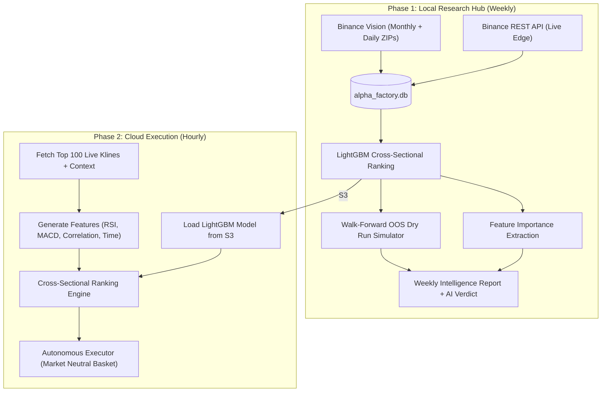
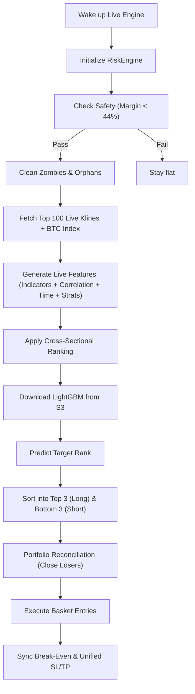

# Alpha Factory — System Architecture

> A quantitative crypto research and trading system. Pure Binance data powers a **LightGBM Cross-Sectional Ranking Engine** with Walk-Forward Out-of-Sample validation and an autonomous market-neutral executor on Hyperliquid.

---

## The Big Picture

Alpha Factory is a **two-phase** system:

1. **Local Research Hub** (Weekly) — Ingests years of Binance historical data (klines, index prices, OI, funding), trains a **LightGBM Cross-Sectional Ranking** model for pure alpha prediction, runs a **Walk-Forward OOS Dry Run Simulation** to validate the model's predictive power, and produces a **Glass-Box Intelligence Report** with AI-powered verdicts.

2. **Cloud Execution Layer** (Hourly) — An autonomous **Live Inference Engine** pulls the LightGBM/XGB ensemble from S3, ranks the top 100 Hyperliquid assets in real-time using a **Hierarchical Macro-Shield**, and manages a concentrated portfolio (Top 5 Longs, Bottom 5 Shorts) with dynamic **Hysteresis-Based Rebalancing**.

---

## Advanced Features (Phase 4 Hardening)

The system now implements advanced quant-finance patterns to eliminate bias and maximize predictive reliability:

1. **Hierarchical Macro Injection**: Lower-timeframe models (15m, 1h) are anchored by 4h macro-conviction signals. This prevents the "Day Trader's Fallacy" by forcing short-term trades to align with the dominant market trend.
2. **Leak-Free OOF Injection**: Uses a **3-Fold Walk-Forward Out-Of-Fold** pipeline for training. Macro signals are injected into training data using "blind" models that have never seen the target data, ensuring zero lookahead bias.
3. **Magnitude-Aware Target Regression**: Instead of simple classification, the model predicts a **Hybrid Z-Score** (50% Raw Magnitude, 50% Risk-Adjusted Magnitude). This forces the model to prioritize "Big Movers" rather than just direction.
4. **Regime-Conditional Scaling**: All features and weights are scaled based on the **Market Regime Score** (derived from BTC 24h trend/volatility), allowing the bot to pivot between Momentum and Mean-Reversion.
5. **Macro Risk Safeguard**: Live trades are automatically dampened if the 15m signal conflicts with the 4h conviction, protecting the portfolio during macro reversals.

### Data Purity Policy
All historical and live-edge data is sourced **exclusively from Binance** (API + Vision archives). Hyperliquid is used only for execution, tradability filtering, and live market context — never as a data source for the research database.



---

## Master CLI Reference (`master.py`)

The `master.py` script is the single entry point for all operations.

### `ingest` - Historical Data Pipeline
Downloads historical ZIPs from Binance Vision, patches gaps, and audits the result.
```bash
# Ingest the Top 100 Hyperliquid coins with default timeframes (15m, 1h, 4h)
python master.py ingest --top 100

# Ingest specific symbols with custom timeframes
python master.py ingest --symbols BTC/USDT,ETH/USDT --timeframe 1h,4h --years 4
```

### `full` - End-to-End Research Cycle
Runs the complete intelligence cycle: [Optional Ingest] → Train Model → OOS Simulation → Generate AI Report.
```bash
# Standard Weekly Run (Train & Report on existing Futures data)
python master.py full --market futures

# Bootstrap Run (Download Top 100 FIRST, then Train & Report)
python master.py full --top 100 --market futures

# Power User Flags
python master.py full --market futures --force          # Force retraining (ignores cached model)
python master.py full --market futures --dry-run-weeks 8  # Simulate 8 weeks of Out-Of-Sample trading
```

### `report` - Generate Intelligence Report Only
Runs the OOS simulator using an already cached model and generates the Weekly Intelligence Report.
```bash
python master.py report --market futures
python master.py report --market futures --dry-run-weeks 4
```

### `audit` - Standalone Data Auditor
Scans the database for gaps, spikes, and missing tokens, generating a health report card (A+ to F).
```bash
python master.py audit --market futures
python master.py audit --market futures --symbols BTC/USDT
```

### `status` - Database Overview
Quickly prints the row counts and date ranges of all tables in the SQLite database.
```bash
python master.py status
```

---

## Directory Structure

```
asset-analysis/
├── master.py                        # CLI entry point — runs everything
├── alpha_factory.db                 # Central SQLite database
├── .env                             # API keys, Telegram creds, DB path override
│
├── data_pipeline/                   # Data Foundation
│   ├── database.py                  #   Schema: ohlcv, index_ohlcv, symbol_metrics, funding_rate, sync_state, unfillable_gaps
│   ├── sync_manager.py              #   Binance Vision bulk download orchestration (all data types)
│   ├── binance_vision.py            #   Monthly ZIP + Daily Bridge downloads (klines, index, metrics, funding)
│   ├── universal_gap_patcher.py     #   Stateful gap patching with unfillable gap tracking
│   ├── hyperliquid_sync.py          #   HL universe listing, top-N by volume, live klines, live meta context
│   └── data_auditor.py              #   Non-destructive gap/spike/health grading (A+ → F) with unfillable gap forgiveness
│
├── analytics/                       # AI & Intelligence
│   ├── cross_sectional.py           #   LightGBM cross-sectional ranking model (training + S3 export)
│   ├── weekly_orchestrator.py       #   Walk-Forward OOS: Load prev model → Simulate → Train new → Report
│   ├── generate_report.py           #   Glass-Box intelligence report (OOS metrics + feature importance + AI)
│   ├── llm_analyzer.py              #   OpenRouter LLM with Glass-Box context for institutional verdicts
│   └── models/                      #   Cached model files (lightgbm, metadata)
│
├── backtester/                      # Dry Run Simulation
│   └── dry_run_simulator.py         #   Vectorized Top-N/Bottom-N portfolio simulator
│
├── bot/                             # Live Trading (AWS Lambda)
│   ├── config.py                    #   Environment: bucket, keys, margin limits, testnet toggle
│   ├── bot_executor.py              #   LiveInferenceEngine + executor_handler Lambda entry
│   ├── strategies.py                #   12 VectorStrategy classes + STRATEGY_CONFIG registry
│   ├── risk_engine.py               #   RiskEngine: margin safety, SL/TP, break-even, zombies
│   ├── data_feed.py                 #   MarketData (API + local DB), AssetManager, daily receipt
│   ├── indicators.py                #   ADX (Wilder), Point of Control, CVD slope
│   └── utils.py                     #   S3Interface, StateManager, Telegram Notifier
│
└── reports/                         # Archived timestamped intelligence reports
```

---

## Data Foundation

### Ingestion Flow

The canonical ingestion command is:
```bash
python master.py ingest --top 100
```
Default timeframes: `15m, 1h, 4h`.

This triggers the **Automated Pipeline** (fully automated):
1. **Symbol Discovery**: `hyperliquid_sync.get_hl_top_by_volume(100)` → Top 100 HL perps by 24h volume.
2. **Binance Vision Download** (per symbol): `sync_manager.sync_from_binance_vision()` fetches 4 data types:
   - `klines` → `ohlcv` table
   - `indexPriceKlines` → `index_ohlcv` table
   - `metrics` (OI, long/short ratios) → `symbol_metrics` table
   - `fundingRate` → `funding_rate` table
3. **Universal Gap Patcher**: `universal_gap_patcher.py` scans for temporal gaps, fetches daily ZIPs to fill them, and permanently blacklists confirmed empty archives in the `unfillable_gaps` table.
4. **Data Auditor**: Prints a final health report card (Grade A+ → F) for every partition, forgiving unfillable gaps.

> [!NOTE]
> **Survivorship Bias & Symbol Universe (M-4)**: The weekly cycle queries all historically ingested symbols present in `ohlcv` to build the training set. This design mitigates survivorship bias by ensuring that historically delisted or inactive coins remain part of the training data as long as their history remains in the database.

### Ingestion Sources

| Source | File | Purpose |
|:--|:--|:--|
| **Binance Vision** | `binance_vision.py` | Free public CSV archives. Monthly ZIPs + **Daily Bridge** for current month (zero-gap). Supports klines, indexPriceKlines, metrics, and fundingRate. |
| **Gap Patcher** | `universal_gap_patcher.py` | Fetches daily ZIPs for missing periods. Tracks unfillable gaps in SQLite. |
| **Live Edge Sync** | `master.py cmd_sync_live` | Fetches latest 100 candles from Binance API for all DB symbols. |

### Hyperliquid Integration (Execution Only)

`hyperliquid_sync.py` provides critical services for the **execution layer**, not for data ingestion:
- **Universe Listing**: `get_hyperliquid_universe()` — returns all tradable perp names.
- **Top-N Discovery**: `get_hl_top_by_volume(limit)` — ranks HL perps by 24h volume for ingestion targeting.
- **Live Market Context**: `get_live_meta_ctx()` — fetches real-time oracle prices, OI, and funding for all assets.
- **Live Klines**: `get_latest_candles(symbol, interval, limit)` — fetches recent candles for live inference.

### Database Schema (`database.py`)

| Table | Purpose | Primary Key |
|:--|:--|:--|
| `ohlcv` | All candle data | `(symbol, timeframe, market, timestamp)` |
| `index_ohlcv` | Index price candles (spot reference) | `(symbol, timeframe, timestamp)` |
| `symbol_metrics` | OI, long/short ratios | `(symbol, timestamp)` |
| `funding_rate` | Funding rate history | `(symbol, calc_time)` |
| `sync_state` | Resume-point tracker per partition | `(symbol, timeframe, market, data_type)` |
| `unfillable_gaps` | Confirmed empty Binance archives (blacklist) | `(table_name, symbol, timeframe, start_ts, end_ts)` |

Uses **WAL** journal mode with tuned cache for concurrent read performance.

### Data Integrity Suite

`data_auditor.py` provides **non-destructive** health checks:
- **Gap Detection**: Identifies missing candles via timestamp diff analysis.
- **Unfillable Gap Forgiveness**: Queries `unfillable_gaps` table and subtracts confirmed missing durations from the penalty.
- **Spike Detection**: Flags candles with >20% open→close moves.
- **Health Grading**: A+ (≥98%) through F (<50%), based on missing data ratio and anomaly count.

---

## The Cross-Sectional Ranking Engine (`cross_sectional.py`)

### Architecture
A **LightGBM regression model** trained on cross-sectionally ranked features to predict the forward return rank of each asset relative to the entire market.

### Training Pipeline
1. **Aggregated DataFrame Construction**: Fetches all symbols from the database. For each symbol, merges `ohlcv`, `index_ohlcv`, `symbol_metrics`, and `funding_rate` via `merge_asof`.
2. **Feature Engineering**: Computes per-symbol indicators (RSI, MACD, volatility), derivative fuel (basis, OI z-score, funding delta, whale vs. retail sentiment divergence), market correlation (`corr_to_index`), cyclic time features (`hour_sin/cos`, `day_sin/cos`), and dynamic momentum and volatility delta features.
3. **Cross-Sectional Ranking**: At each timestamp, all continuous features are ranked across symbols using percentile ranks (`rank(pct=True)`).
4. **Walk-Forward Split**: 85% train / 15% validation (chronological, no leakage).
5. **LightGBM Training**: GBDT regression with early stopping on validation RMSE.
6. **Validation**: Spearman rank correlation between predicted and actual forward return ranks.

### Feature Set

| Category | Features |
|:--|:--|
| **Ranked Continuous** | `rank_rsi`, `rank_macd`, `rank_volatility_20`, `rank_basis_pct`, `rank_oi_usd`, `rank_funding_rate`, `rank_sum_toptrader_long_short_ratio`, `rank_corr_to_index`, `rank_oi_delta_4`, `rank_funding_delta_4`, `rank_sum_toptrader_ls_delta_4`, `rank_volatility_zscore`, `rank_volume_zscore`, `rank_relative_strength_btc`, `rank_cvd_slope_5`, `rank_price_cvd_divergence`, `rank_sentiment_divergence`, `rank_trend_convergence`, `rank_bbw_squeeze`, `rank_funding_basis_divergence`, `rank_vol_volatility_ratio`, `rank_market_beta`, `rank_rsi_divergence`, `rank_vpt_slope` |
| **Time-Aware** | `hour_sin`, `hour_cos`, `day_sin`, `day_cos` |

### Model Persistence
- Model: `analytics/models/cross_sectional_lgbm.txt` (LightGBM native) → also uploaded to S3
- Metadata: `analytics/models/cross_sectional_lgbm_meta.json` (validation RMSE, Spearman correlation, p-value)

---

## Walk-Forward OOS Dry Run (`weekly_orchestrator.py` + `dry_run_simulator.py`)

**Goal**: Validate the model's real-world predictive power without lookahead bias.

### Sequence (strict order)
1. **Load Previous Model** — The model trained LAST week.
2. **OOS Simulation** — Use last week's model to predict THIS week's data. Simulate a Top 5 Long / Bottom 5 Short portfolio.
3. **Train New Model** — Retrain LightGBM on the full updated dataset for the upcoming week.
4. **Feature Importance** — Extract gain-based feature importance from the new model.
5. **Per-Asset Attribution** — For Top 5 and Bottom 5 assets, identify extreme features that drove their ranking.

### Simulation Mechanics (`dry_run_simulator.py`)
- **Vectorized**: No event-driven loops. Pure pandas operations.
- **Transaction Costs**: Taker fee (0.055%) + slippage (5 bps) applied on both sides at each rebalance.
- **Rebalance Frequency**: Every 6 bars (6 hours for 1h candles).
- **Portfolio**: Equal-weighted, dollar-neutral long/short basket.

### Output Metrics
| Metric | Description |
|:--|:--|
| **Total Return** | Net cumulative return after costs |
| **Sharpe Ratio** | Annualized risk-adjusted return |
| **Profit Factor** | Gross profit / gross loss |
| **Win Rate** | % of rebalances with positive net return |
| **Max Drawdown** | Worst peak-to-trough decline |

---

## Weekly Intelligence Report (`generate_report.py`)

**Goal**: Generate a human-readable Markdown report with Glass-Box AI analysis.

### Report Sections
1. **Model Training Summary**: Spearman ρ, RMSE, health grade (//).
2. **OOS Dry Run Results**: Sharpe, PF, Win Rate, Max Drawdown.
3. **Top 5 Longs**: Assets with highest predicted rank + key feature drivers.
4. **Bottom 5 Shorts**: Assets with lowest predicted rank + key feature drivers.
5. **Feature Importance**: Top 10 model features by gain with visual bars.
6. **AI Executive Verdict**: 3-paragraph institutional analysis from OpenRouter LLM.

### AI Verdict ("Glass Box")
The LLM receives the **full model context**, not just numbers:
- OOS simulation metrics
- Feature importance rankings
- Per-asset extreme features for Top/Bottom baskets
- Model training metadata

This enables the AI to write intelligent regime analysis like:
> *"The model's dominant reliance on rank_funding_rate (23.1%) and rank_oi_usd (18.7%) indicates a derivatives-driven regime where funding rate arbitrage and open interest anomalies provide the primary alpha signal..."*

---

## The Cloud Execution Engine (`bot_executor.py`)

**Goal**: Hourly re-inference loop that dynamically ranks the market and manages a market-neutral portfolio.

Runs on **AWS Lambda**. Two task handlers:

### Task: `execute_trades`

#### Process
1. Ping Hyperliquid for the top 100 assets by volume to guarantee tradability and deep liquidity.
2. Fetch live Klines (15m, 100 candles) for all 100 symbols + BTC index.
3. Compute continuous features (RSI, MACD, Volatility, Basis, Correlation to Index, cyclic time features, and delta velocity features).
4. Rank all continuous features cross-sectionally across the 100 assets.
5. Download the `cross_sectional_lgbm.txt` model from S3 and predict forward return ranks.
6. Target the Top 5 for Long positions and Bottom 5 for Short positions.
7. **Portfolio Reconciliation**: Close any position no longer in the Top/Bottom 5 basket.
8. Execute new basket entries via `RiskEngine`.
9. Sync break-even and unified SL/TP orders for all active positions.



#### Fallback Logic
If the LightGBM model fails to download or load (missing S3 file, `ImportError`, corrupt model), the engine gracefully falls back to a simple momentum rank: `predicted_rank = (rank_rsi + rank_macd) / 2`.

### Task: `send_daily_report`
Fetches fills, funding, and fees from Hyperliquid and sends a Telegram PnL receipt.

### Risk Engine Checks
Before any trade executes:
- **Margin Safety**: Account margin utilization < 44%.
- **Liquidity Floor**: Open Interest > $10M.
- **Funding Trap**: Funding rate < ±2%.
- **POC Gravity**: Price must be on the favorable side of the Point of Control.

### Telegram Security
`utils.py` validates `TELEGRAM_CHAT_ID` before every message. Unauthorized group messages are silently dropped.

---

## Strategy Catalog (12 Families)

All strategies implement `VectorStrategy.get_signal_column(df) → Series[0, 1, -1, 2]`.

### Trend Following
| Strategy | Key Idea | Exits |
|:--|:--|:--|
| `SimpleBreakout` | Donchian-style N-period breakout | Flips + ATR |
| `EMACrossover` | Fast/Slow EMA cross events | Flips + ATR |
| `MACDStrategy` | MACD cross with ADX trending filter | Smart 2 + ATR |
| `BBSqueezeBreakout` | Bollinger squeeze → band break | Flips + ATR |

### Mean Reversion
| Strategy | Key Idea | Exits |
|:--|:--|:--|
| `RSIStrategyFast` | Fast RSI hooks + BB crash override | Smart 2 (re-entry zone) |
| `BollingerReversion` | Band touch + green/red bounce confirm | Smart 2 (failed bounce) |
| `OrderFlow` | VWAP Value Area + CVD absorption | Smart 2 (CVD flip) |

### Order Flow
| Strategy | Key Idea | Exits |
|:--|:--|:--|
| `OrderFlowSweep` | Sweep PA level + CVD confirmation | Flips + ATR |
| `OrderFlowReclaim` | Wick below bodies + volume + CVD | Flips + ATR |

### Hybrid / Confluence
| Strategy | Key Idea | Exits |
|:--|:--|:--|
| `HybridWilder` | RSI (Wilder) × Bollinger double confirm | Smart 2 |
| `HybridCutler` | RSI (Cutler/SMA) × Bollinger double confirm | Smart 2 |
| `PriceAction` | PA breakout + deviation + volume filter | Flips + ATR |

### Optional Filters (per-strategy)
- **VWAP Filter**: Confirms trade is on the right side of daily volume.
- **HTF Trend Filter**: Requires 1h/4h EMA trend alignment.

---

## Signal Taxonomy

| Signal | Meaning | Bot Action |
|:--|:--|:--|
| `0` | Neutral | Hold current state. |
| `1` | Buy / Long | Open Long (if Risk Engine approves). |
| `-1` | Sell / Short | Open Short (if Risk Engine approves). |
| `2` | Exit | Force close (thesis invalidated). |

---

## CLI Reference (`master.py`)

### Data Commands

| Command | Key Flags | Description |
|:--|:--|:--|
| `ingest` | `--top 100`, `--timeframe 15m,1h,4h` | Automated pipeline: Binance Vision download → Gap Patcher → Data Auditor. |
| `status` | — | Database health: row counts, date ranges, file size. |
| `audit` | `--market futures`, `--symbols BTC/USDT` | Non-destructive gap/spike analysis with A→F grading (unfillable gap aware). |

### Intelligence Commands

| Command | Key Flags | Description |
|:--|:--|:--|
| `report` | `--market`, `--force-train`, `--dry-run-weeks 4` | Run intelligence cycle: OOS Simulate → Train → Report. |
| `full` | `--top 100`, `--market`, `--force-train` | Complete weekly cycle: ingest? → sync → simulate → train → report. |

---

## Key File Constants (`bot/config.py`)

| Constant | Value | Purpose |
|:--|:--|:--|
| `AWS_BUCKET` | `flaminghotcheetos` | S3 bucket for models and intelligence. |
| `CONFIG_FILE` | `champion_blueprint.json` | Legacy single-champion config. |
| `LEADERBOARD_FILE` | `leaderboard_results.json` | Per-coin best results. |
| `MARGIN_LIMIT` | `0.44` (44%) | Maximum margin utilization before abort. |
| `DCA_LIMIT` | `1` | Maximum position layers. |
| `TESTNET_MODE` | Env-driven | Toggles between testnet and mainnet URLs. |

---

## Data Flow Summary

```
Binance Vision (Monthly + Daily ZIPs)
  → klines, indexPriceKlines, metrics, fundingRate
Universal Gap Patcher (Daily ZIPs + Unfillable Blacklist)
        │
        ▼
   alpha_factory.db (Local SQLite, WAL mode)
   ├── ohlcv          (candle data)
   ├── index_ohlcv    (index/spot reference prices)
   ├── symbol_metrics  (OI, long/short ratios)
   └── funding_rate   (funding history)
        │
        ├──── Weekly Orchestrator (Walk-Forward OOS Pipeline)
        │     ├── Load Previous LightGBM Model
        │     ├── OOS Dry Run Simulation (Top 10 Long / Bottom 10 Short)
        │     ├── Train NEW LightGBM Model ──► cross_sectional_lgbm.txt ──► S3
        │     ├── Feature Importance Extraction
        │     └── Glass-Box Intelligence Report + AI Verdict
        │
        └──── Bot Executor (AWS Lambda, Hourly)
              ├── Fetch Top 100 HL Live Klines
              ├── Generate Features (RSI, MACD, Corr, Time, Strats)
              ├── Cross-Sectional Rank → LightGBM Predict
              ├── Top 3 Long / Bottom 3 Short
              ├── Portfolio Reconciliation
              └── RiskEngine Execution → Hyperliquid
                                │
                                ▼
                     Telegram Notifier
                  (Private PnL Reports)
```
